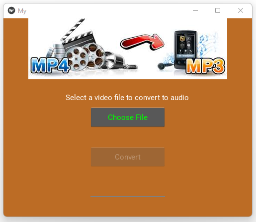
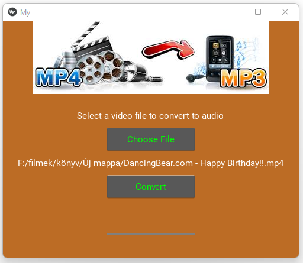
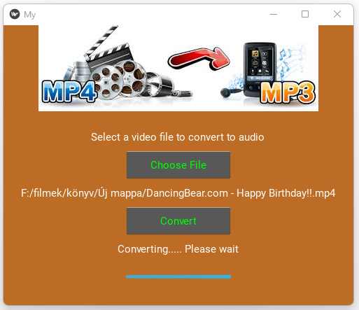
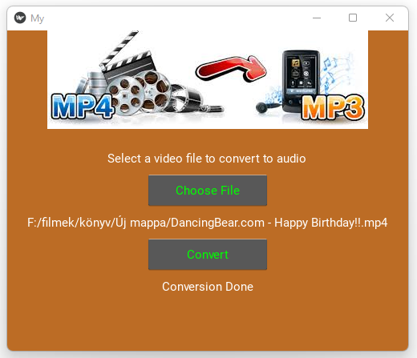

# MP4 to MP3 Converter

This application allows users to convert MP4 files to MP3 files. The user can select a file from their computer and convert it to an MP3 file. The user can also select the location where the MP3 file will be saved.

## Features

- Select an MP4 file from your computer
- Select the location where the MP3 file will be saved
- Convert the MP4 file to an MP3 file
- Display a progress bar while the conversion is in progress
- Display a success message when the conversion is complete
- Display an error message if the conversion fails
- Display a warning message if the user tries to convert a file that is not an MP4 file

## Technologies Used

- Python
- Tkinter
- MoviePy
- Kivy
- KivyMD

## How to Use

1. Clone the repository
2. Install the required dependencies
3. Run the application
4. Select an MP4 file from your computer
5. Select the location where the MP3 file will be saved
6. Click the "Convert" button
7. Wait for the conversion to complete
8. View the success/error/warning message

## Screenshots

## License

This project is licensed under the MIT License - see the [LICENSE](LICENSE) file for details.